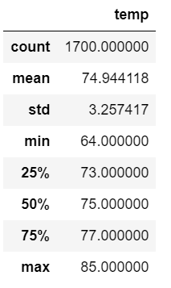
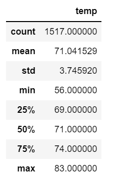

# Surfs Up: Surf and Shake Shop

## Overview

Weather analysis for Oahu is performed to encourage investors in a new surf and shake shop.  To ensure the shop is viable, it needs to be certain that the weather permits for year round surfing and ice cream. Using SQLite, SQLAlchemy, and Pandas, the weather data is queried to analyze the months of June and December.  

## Analysis 

### Observations
* There is missing data for the December month. There are 1700 data points for June and only 1517 data points in December. 
* The average temperature is approximately 4 degrees warmer in June than in December.  The standard deviation is 3.25 and 3.75 in June and December respectively. 
* While the quartiles are typically 4 degrees cooler in December than June, the minimum temperate is 9 degrees colder in the winter. 

The summary of results are as following(June on left, Dec on right): 




## Results

### Coding Results
```
#Query Measurements data for date and observed temperature
dec_results = session.query(measurement.date, measurement.tobs).filter(extract('month', measurement.date) == 12 ).all()
#Create a list for temperature
dec_temps =[]
[dec_temps.append(day[1]) for day in dec_results]
#Create a DataFrame
dec_temps_df = pd.DataFrame(dec_temps, columns=['temp'])
#Calculate summary statistics
dec_temps_df.describe()
```

### Business Results

The fact that there is little change from the summer months to the winter months, the store idea seems like it will hold.  Oahu's weather supports having ice cream year round, as well as a continuous surfing scene. There should be more analysis completed on understanding the rain and wind patterns, as well as the wave activity to ensure customers will be active for 12 months. 
